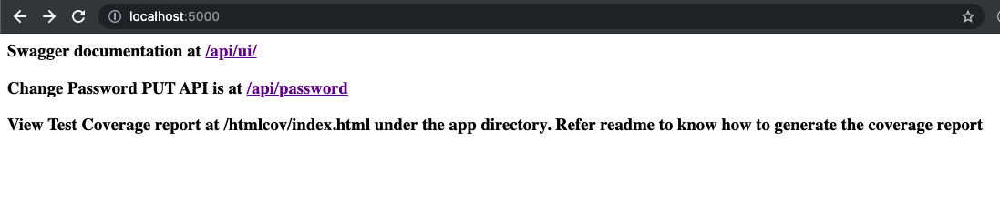
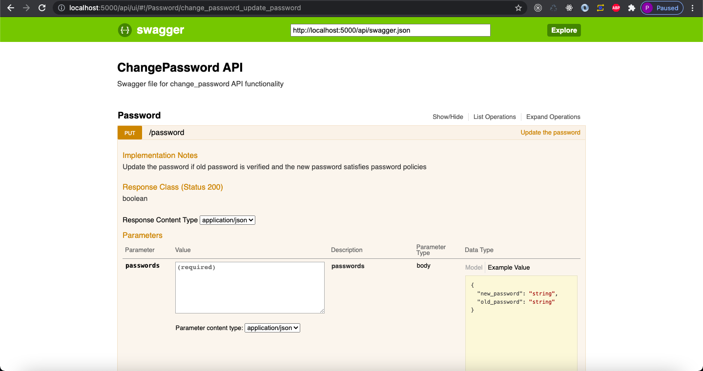
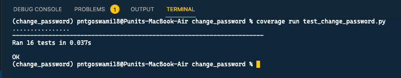
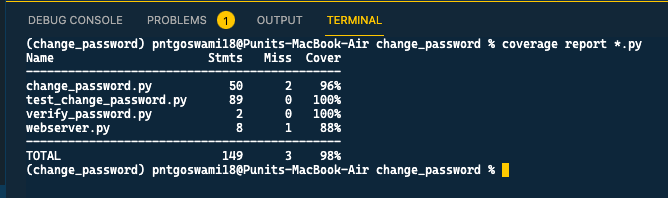
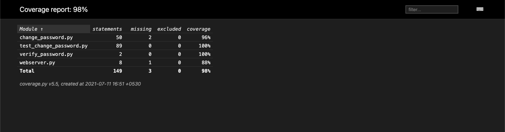

# change_password
The project implements the ChangePassword method as a ReSTful API. This also contains the automated unit tests for the defined functionalities. Uses the unittest mick library to mock the old password verification while testing the ChangePassword method.

The implemented password requiremnts are as follows:  
1. At least 18 alphanumeric characters and list of special chars !@#$&*  
2. At least 1 Upper case, 1 lower case ,least 1 numeric, 1 special character  
3. No duplicate repeat characters more than 4  
4. No more than 4 special characters  
5. 50 % of password should not be a number  

Test coverage is measured using the coverage module.
The API service is dockerized. 

## Installation
### Non-docker installation
You can use either the default `pip` or `pipenv` to install the dependencies; **requirements.txt** and **Pipfile.lock** are both furished for the sake.  
Installation through `pip`:
```
pip install -r requirements.txt
```
Installation through `pipenv`, requires you to install `pipenv` first:
```
pipenv install
```
### Dockerized installation
Build the docker image for API service
```
docker build --tag change_password_app .
```
Spawn a container from the generated image
```
docker run --name change_password_app -p 5000:5000 change_password_app
```

## Usage
### ChangePassword functionality
To check the functionality of the API, start the webserver
```
python webserver.py
```
Navigating to http://localhost:5000/ should show you the home page.  
The swagger documentation is hosted under http://localhost:5000/api/ui/ where you can manually test out the API.  

### Testing
Testing is implemented through `unittest` and `mock` module. The test cases can be executed as 
```
coverage run test_change_password.py
```

### Coverage
When the test cases are run through the `coverage` module, the test case statuses can be converted into a report.
```
coverage report *.py  
```
  

Export these results into an html report.
```
coverage html *.py 
```
The generated report can be viewed at [htmlconv/index.html](htmlcov/index.html)
